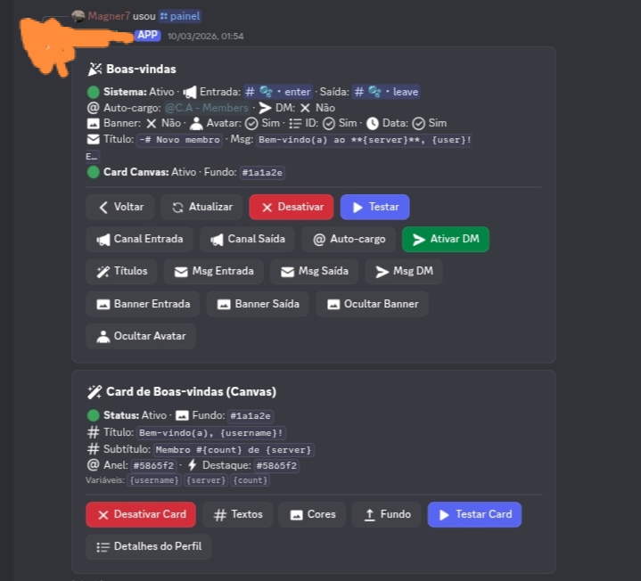
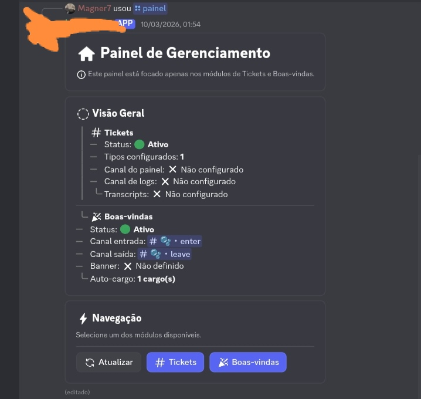
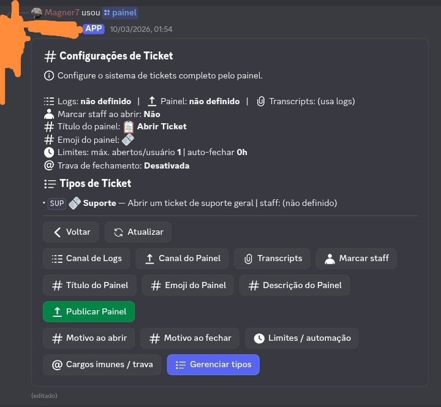

# 🫧 SystemManagement – Components V2

Este projeto foi iniciado há cerca de duas semanas como um estudo prático sobre Discord Components V2, utilizando TypeScript e discord.js.

O objetivo foi entender melhor como funcionam interfaces interativas dentro do Discord, como painéis, botões, menus e modais, enquanto construía uma base de bot organizada e fácil de expandir.

O código foi estruturado de forma simples para facilitar leitura, manutenção e experimentação.

---

# Funcionalidades

Atualmente o projeto inclui:

• Painel administrativo interativo
• Sistema de tickets
• Sistema de boas-vindas
• Configurações feitas diretamente no Discord
• Uso de botões, selects e modais (Components V2)

---

# Instalação

Clone o repositório:

```
git clone https://github.com/magner7/SystemManagement-ComponentV2.git
cd SystemManagement-ComponentV2
```

Instale as dependências:

```npm install```

Crie o arquivo ".env":
```
TOKEN=SEU_TOKEN_DO_BOT
CLIENT_ID=SEU_CLIENT_ID
```
---

# Executando o bot

Modo desenvolvimento:

```npm run dev```

Ou diretamente:

```npx tsx src/index.ts```

---

# Estrutura do projeto

```js
src
 ├ commands
 ├ events
 ├ views
 ├ lib
 └ index.ts
```
---
# Demonstração 
<p align="center">
  
</p>

<p align="center">
  
</p>

<p align="center">
  
</p>

---

# Sobre o projeto

Este repositório foi criado principalmente para aprendizado e experimentação com a nova estrutura de Components V2 do Discord.

A ideia é explorar diferentes formas de construir interfaces dentro do Discord mantendo uma base de código organizada.

---

# Contribuição

Caso queira contribuir com melhorias, correções ou novas ideias, sinta-se livre para enviar alterações ou abrir um pull request.
